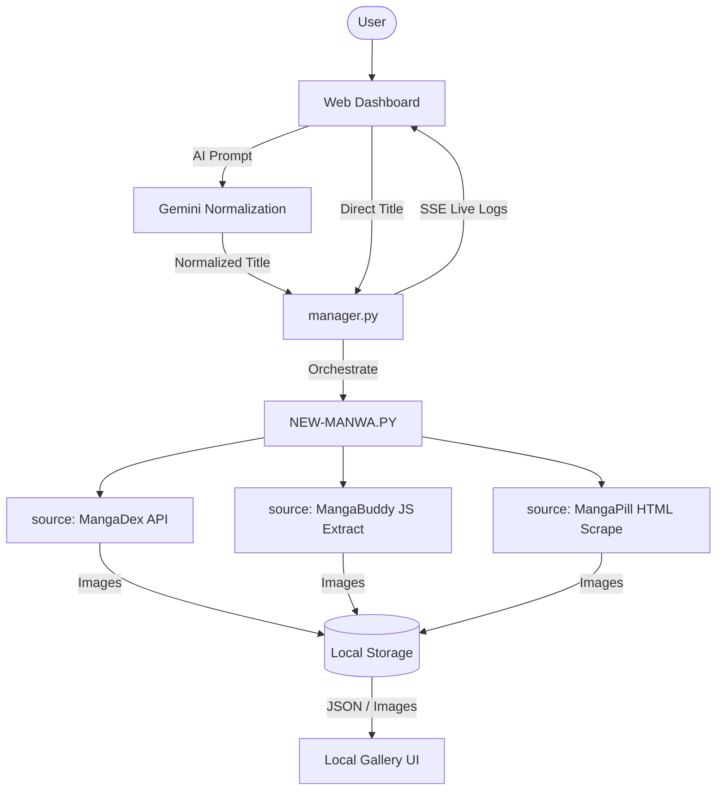

<div align="center">

# ⚡ MANHWA HUB


**An AI-Powered, Battle-Tested Manhwa & Manga Orchestrator**

[](https://www.python.org/)
[](https://fastapi.tiangolo.com/)
[](https://opensource.org/licenses/MIT)

</div>

**Manhwa Hub** is a next-generation scraping engine and web dashboard designed to seamlessly search, discover, and download high-quality manga and manhwa panels. It abandons the unreliable "dead scrapers" approach in favor of a highly curated, production-grade **3-Source Titan Engine**.

---

## ✨ Key Features

### 🧠 Dual-Mode Discovery
*   **AI Recommendation Engine:** Powered by Gemini AI. Ask for "Top dark fantasy manhwa like Solo Leveling" and get curated, normalized titles pushed directly to the downloader.
*   **Direct Download Bar:** Skip the AI and directly queue titles with absolute precision (e.g., `Tower of God 1-50` or `Omniscient Reader ch 5`).

### 🛡️ The "Titan" Engine (3 Verified Sources)
Built for 2026 web scraping realities, bypassing Cloudflare blocks and broken DOMs:
1.  **MangaDex API (Gold):** Direct, official REST API integration for perfect metadata and high-quality at-home server image routing.
2.  **MangaBuddy (Silver):** Advanced JS-parsing extraction. Bypasses standard HTML scraping defenses by extracting underlying lazy-loaded CDN arrays (`var chapImages = ...`), ensuring 100% complete chapters.
3.  **MangaPill (Silver):** Clean HTML parsing fallback with a massive cross-referenced catalog.

### ⚙️ Production-Grade Orchestration
*   **Live Web Console:** Real-time Server-Sent Events (SSE) stream terminal logs directly to your browser's UI. Watch rate-limits, fallbacks, and downloads happen live.
*   **Smart Fallback & Partial Recovery:** If Source A fails halfway, it saves the downloaded panels. If a source is rate-limited, it automatically applies exponential backoff with jitter.
*   **Automatic UTF-8 Healing:** Fully resolves Windows `charmap` codec crashes when processing Japanese, Chinese, and Vietnamese aliases.
*   **Built-in Gallery:** Beautiful, responsive grid UI to instantly read what you've just downloaded.

---

## 🚀 Quick Start

### 1. Requirements

Make sure you have Python 3.8+ installed.

```bash
# Clone the repository and cd into it
cd "MANGA DOWNLOADER"

# Install dependencies (the engine will auto-install requests and bs4 if missing, but for the server:)
pip install fastapi uvicorn requests beautifulsoup4 google-genai
```

### 2. Set Up AI (For Recommendations)
If you want to use the AI Search feature, create a `.env` file in the root directory and add your Google Gemini API key:
```env
GEMINI_API_KEY=your_api_key_here
```
*(If you don't supply a key, you can still use the **Direct Download** feature!)*

### 3. Run the Web Server

Start the orchestration server:
```bash
python server.py
```
Open your browser and navigate to: **`http://localhost:8000/static/index.html`**

---

## 💻 CLI Usage

You don't need the web UI to use the engine! `NEW-MANWA.PY` is a powerful standalone CLI tool.

```bash
# Interactive mode (searches, lists results, asks you what to download)
python NEW-MANWA.PY "Omniscient Reader"

# Download all chapters automatically
python NEW-MANWA.PY "Solo Leveling" --auto

# Download a specific range of chapters (e.g., Chapter 1 to 5)
python NEW-MANWA.PY "The Beginning After The End" --ch 1 5 --auto

# Specify a custom output directory
python NEW-MANWA.PY "Wind Breaker" --auto --output "D:/My_Comics"
```

---

## 🏗️ Architecture



## 📜 Disclaimer
This software is provided for educational and archival purposes only. Users are responsible for adhering to the Terms of Service of the respective sources they interface with. Support official releases and creators wherever possible.
